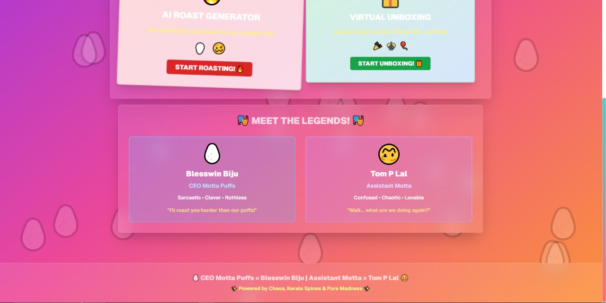

# Motta Puffs 🎯

## Basic Details
### Team Name: Tech Titans

### Team Members
- Team Lead: Blesswin Biju - Sahrdaya College Of Advanced Studies
- Member 2: Tom P Lal - Sahrdaya College Of Advanced Studies

### Project Description
Motta Puff is a website that takes a self-description from a user and uses AI to generate a humorous and personalized roast. As an added bonus, it also features a fun digital gift-unwrapping experience.

### The Problem (that doesn't exist)
In a world full of self-love and positive affirmations, we found a critical lack of personalized, harmless insults to keep everyone grounded. People are becoming too comfortable with themselves and need a friendly reminder that nobody's perfect.

### The Solution (that nobody asked for)
Our AI, affectionately known as the 'Motta Roaster,' takes your self-aggrandizing description and turns it into a masterpiece of comedic criticism. We've also included a gift unwrapping mini-game because sometimes you need a little digital treat after being roasted.

## Technical Details
### Technologies/Components Used
For Software:

Languages: [e.g., JavaScript, Python, HTML, CSS]

Frameworks: [e.g., React, Flask, Django]

Libraries: [e.g., OpenAI API, DALL-E 3, Node.js]

Tools: [e.g., Git, VS Code, npm]

For Hardware:
- [List main components]
- [List specifications]
- [List tools required]

### Implementation
For Software:
# Installation
[commands]

# Run
[commands]

### Project Documentation
For Software:

# Screenshots (Add at least 3)

*Add caption explaining what this shows*

*Add caption explaining what this shows*

*Add caption explaining what this shows*

# Diagrams

*Add caption explaining your workflow*

For Hardware:

# Schematic & Circuit

*Add caption explaining connections*

*Add caption explaining the schematic*

# Build Photos

*List out all components shown*

*Explain the build steps*

*Explain the final build*

### Project Demo
# Video
[Add your demo video link here]
*Explain what the video demonstrates*

# Additional Demos
[Add any extra demo materials/links]

## Team Contributions

Blesswin Biju (CEO Motta): [Specific contributions, e.g., concept development, AI integration, front-end design]

Tom L Lal (Assistant ): [Specific contributions, e.g., back-end development, gift unwrapping feature, testing]

---
Made with ❤️ at TinkerHub Useless Projects 

